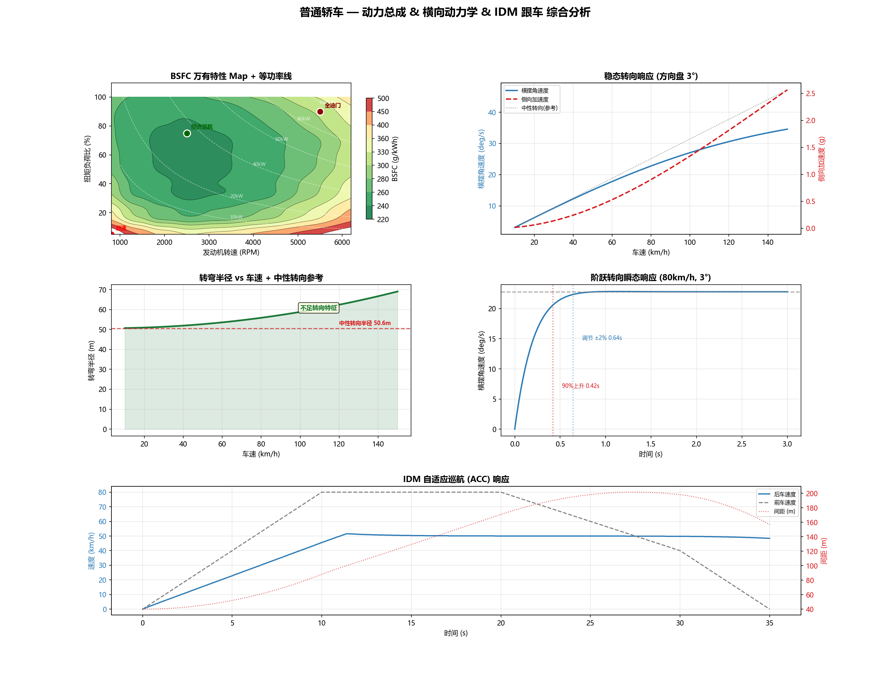

# Vehicle Dynamics Engineering Toolkit

[](https://github.com/Young-skyyy/vehicle-dynamics-toolkit/actions/workflows/test.yml)
[](https://www.python.org/)
[](LICENSE)

*A pure-Python vehicle dynamics simulation toolkit — no MATLAB/Simulink required.*



*BSFC fuel map + iso-power lines | Steady-state cornering | Turning radius | Step steer transient | IDM ACC*

---

## Why This Exists

I built this while learning vehicle dynamics. Every textbook formula — SAE J2263, Pacejka tire model, BSFC bilinear interpolation — looks clean on paper but gets messy in code. This repo is my translation layer: **formula → Python → passing tests → visual output**.

If you're a student preparing for an automotive software testing interview, or learning CAN/UDS protocols, you'll find working reference implementations here.

---

## 30-Second Quick Start

```bash
git clone https://github.com/Young-skyyy/vehicle-dynamics-toolkit.git
cd vehicle-dynamics-toolkit
pip install -r requirements.txt
python vehicle_dynamics.py        # longitudinal + lateral dynamics
python can_demo.py                # CAN bus + UDS diagnostics
python plot_dashboard.py          # 5-in-1 dashboard (generates dashboard.png)
```

---

## What's Inside

| Module | Capabilities |
|--------|-------------|
| **Longitudinal Dynamics** | Engine torque curve → gear ratios → wheel force (replaces simplified P=Fv) |
| **Acceleration** | 0–100 km/h WOT simulation, 5-speed automatic shifting (92% redline upshift) |
| **Resistance** | SAE J2263 dynamic rolling resistance: μ(v)=f₀+f₁v+f₄v⁴ |
| **Fuel Consumption** | BSFC map bilinear interpolation (180 data points) + WLTC Class 3 transient (DFCO fuel-cut + enrichment) |
| **Lateral Dynamics** | 2-DOF bicycle model / slip angles / understeer gradient / Pacejka Magic Formula |
| **IDM Car-Following** | Time headway T, minimum gap s₀, comfortable deceleration b — parameterized |
| **CAN Bus** | 5 ECUs (EMS/BMS/ABS/TCU/BCM), Motorola & Intel byte order, DBC export, bus load monitoring, error injection |
| **UDS Diagnostics** | ISO 14229: Session Control (0x10), Read DID (0x22), Read DTC (0x19), Security Access (0x27), ECU Reset (0x11), DTC Status Byte |

---

## Tests

**209 pytest cases**, CI-enabled via GitHub Actions:

```bash
python -m pytest test_vehicle_dynamics.py test_can_demo.py test_uds.py -v
```

Covers: torque curve interpolation, BSFC bilinear interpolation, CAN encode/decode roundtrip (Motorola & Intel), UDS positive/negative responses, IDM convergence, Pacejka vs. linear tire model comparison.

---

## Key Techniques

- **Engine torque curve**: normalized WOT curve × peak torque → linear interpolation → gear ratio amplification → wheel force
- **BSFC bilinear interpolation**: 15×12 grid lookup on the engine fuel map
- **SAE J2263 coastdown model**: f₀ + f₁v + f₄v⁴ — 4th-order polynomial rolling resistance
- **2-DOF bicycle model**: slip angles → lateral forces → yaw moment → Euler-integrated transient response
- **Understeer gradient**: Kus = Wf/Cf − Wr/Cr, distinguishing understeer/neutral/oversteer
- **Pacejka Magic Formula**: Fy = D·sin(C·arctan(Bα − E(Bα − arctan(Bα))))
- **CAN frame encoding**: 11-bit arbitration ID, 8-byte payload, Motorola & Intel endianness
- **UDS diagnostic stack**: DiagnosticSession state machine, SecurityAccess Seed&Key, ISO 14229-1 DTC Status Byte

---

## Project Structure

```
├── vehicle.py              # Vehicle physics & powertrain
├── lateral_dynamics.py     # Lateral dynamics (bicycle model + Pacejka)
├── bsfc.py                 # BSFC fuel map + bilinear interpolation
├── wltc.py                 # WLTC Class 3 transient fuel simulation
├── can_demo.py             # CAN bus simulation + DBC generation
├── uds.py                  # UDS diagnostic protocol stack
├── plot_dashboard.py       # 5-in-1 dashboard
├── plotting.py             # BSFC contour heatmap
├── test_vehicle_dynamics.py  # 139 unit tests
├── test_can_demo.py        # 42 CAN tests
├── test_uds.py              # 28 UDS tests
├── _constants.py            # Physical constants
└── requirements.txt
```

---

## License

MIT
